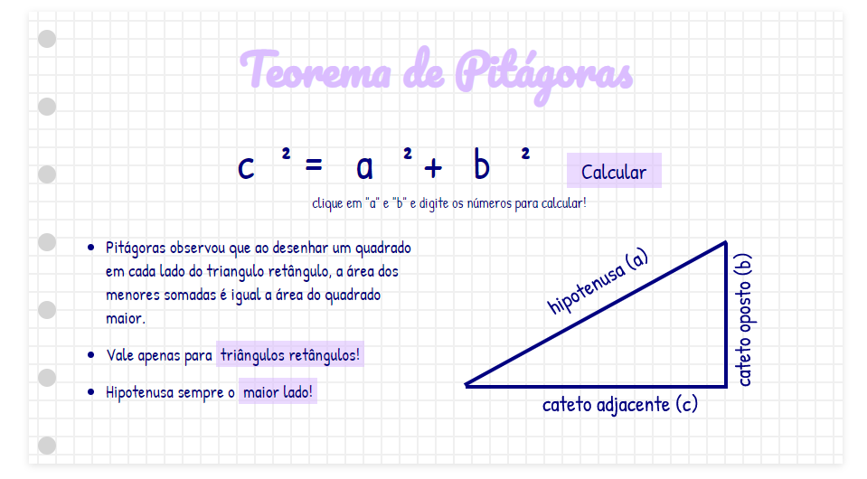

# Pythagoras Calculator

<h4 align="center"><a href="https://pythagoras-calculator-xbom.vercel.app/">Clique para visitar o projeto</a></h4>

## 🎯 Objetivo

Esta aplicação teve como objetivo calcular a hipotenusa de um teorema de pitágoras. Usei resumos de matéria que eu fazia na época do colégio como inspiração de layout.

## 🛠️ Tecnologias utilizadas

Na branch "main":

- HTML;
- CSS;
- React;

Na branch "javascript":

- HTML;
- CSS;
- Javascript;

## 🚀 Como executar o projeto

1. Clone este repositório

`$ https://github.com/giovanaraphaelli/pythagoras-calculator.git`

2. Acesse a pasta do projeto no seu terminal/cmd

`$ cd pythagoras-calculator`

3. Abra a pasta do projeto no VS Code via terminal/cmd

`$ code .`

4. Instale as dependências

`$ yarn install`

5. Execute a aplicação em modo de desenvolvimento

`$ yarn start`

6. A aplicação será aberta na porta: 3000 - acesse http://localhost:3000
